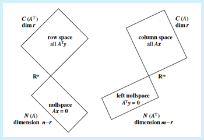
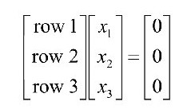

# Orthogonal vectors and subspaces "The 90 degree Chapter"

## Overview:

- Row space is perpendicular to null space
- Column space is perpendicular to left null space

## Orthogonal vectors:

- Two vectors are orthogonal if the angle between them is 90 degrees.
- `x` and `y` are orthogonal if xTy = 0 or yTx = 0.

* **Question**: Which vector is orthogonal to every vector?

Answer

The zero vector.

## Orthogonal subspaces

- Subspace S is orthogonal to subspace T means: every vector in S is orthogonal to every vector in T.
- The blackboard is not orthogonal to the floor; two vectors in the line where the blackboard meets the floor aren’t orthogonal to each other.
- Subspaces should add up to the original space dimension for orthogonality.
- Suppose for 3-Dimension. A plane and a line may form an orthogonal pair as 2 + 1 = 3.
- Similarly two planes in 3-Dimension like the blackboard floor example are not orthogonal.
- In the plane, the space containing only the zero vector and any line through the origin are orthogonal subspaces.
- A line through the origin and the whole plane are never orthogonal subspaces.
- Two lines through the origin are orthogonal subspaces if they meet at right angles.

## Rowspace is orthogonal to nullspace

- **Why ?**
- Because, Ax = 0 means the dot product of x with each row of A is 0.
- 
- Also the product of x with any combination of rows of A must be 0 (Another way to express it).
- The column space is orthogonal to the left nullspace of A because the row space of AT. is perpendicular to the nullspace of AT.
- We can also assume that row space and the nullspace of a matrix subdivide Rn into two perpendicular subspaces.
- For the same reason, in 3-Dimension we can not have two perpendicular lines as rowspace nullspace pair as dimensions don't match the findings. (1 + 1 = 2 but to we needed 3)
- **Example**
<pre>
- A = [ 1 2 5 ]  
      [ 2 4 10 ]

   [ 1 2 5 ]  [x1]   [0]  
   [ 2 4 10 ] [x2] = [0]  
              [x3]

- Rowspace dimension = 1
- Basis = [1]
          [2]
          [5]
- Nullspace dimension = 2 (It is a plane through the origin perpendicular to the Basis of rowspace).
</pre>

- The nullspace and the row space are orthogonal complements in Rn.
- The nullspace contains all the vectors that are perpendicular to the row space, and vice versa.
- The subspaces come in orthogonal pairs

## To solve Ax = b when there is no solution, when no. of eqns (m) > no. of variables (n) :

- Due to measurement error, Ax = b is often unsolvable if m > n.
- Our next challenge is to find the best possible solution in this case.
- The matrix ATA plays a key role in this effort: the central equation is ATAxhat= ATb.
- Here xhat is different form x which is the best possible solution.
- Also ATA is square (n × n) and symmetric.

- **Example**
<pre>
- A = [ 1 1 ]  
      [ 1 2 ]
      [ 1 5 ]

- Then ATA =

  [ 1 1 1 ][ 1 1 ]   [ 3 8 ]  
  [ 1 2 5 ][ 1 2 ] = [ 8 30 ]
           [ 1 5 ]

- Here it is invertible therefore we can find a possible solution.
- ATA is not always invertible.
- Example
  [ 1 1 1 ][ 1 3 ]   [ 3 9 ]  
  [ 3 3 3 ][ 1 3 ] = [ 9 27 ]
           [ 1 3 ]
- Here rank is 1 and it is not invertible.
- Therefore, ATA is invertible exactly when A has independent columns.
</pre>
- **Pointers**:
- N(ATA) = N(A)
- rank of ATA = rank of A.
